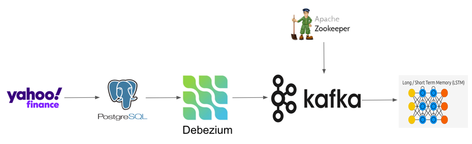

## yfinance_kafka
프로젝트의 데이터 생성 및 예측 모델 담당 레포

[카프카 스트림스 레포](https://github.com/santoryu1118/yfinance_kafka?tab=readme-ov-file)

[기술 블로그](https://www.notion.so/santoryu/yFinance-c179dfdf0bbe4a62855782366cf2a849?pvs=4)

---
### 프로젝트 워크플로
1. yFinance 데이터셋을 다운받아 모델 학습용 training 셋과 test 셋으로 나누었습니다. test 셋에서는 outlier 데이터를 임의로 추가하여, 나중에 kafka streams 단계에서 걸러줍니다.
2. training 데이터 셋을 사용해 기본 LSTM 모델을 학습시킵니다.
3. test 데이터 셋은 실시간 데이터처럼 보이기 위함입니다. 몇초 간격으로 시간 순서대로 PostgreSQL DB에 넣고, kafka connect가 해당 데이터를 읽고 kafka 토픽으로 보내줍니다.
4. kafka로 들어오는 데이터는 예측 모델이 학습하기 적합한 형태로 kafka streams에서 가공되어 valid 타겟 토픽으로 보내집니다. test 셋에서 outlier가 발견되면 rejected 토픽으로 보냅니다.

    (kafka streams에서 moving_avg와 lastTenPrices 데이터 가공, outlier data 제거) 
5. valid 타겟 토픽으로 보내진 데이터는 학습해둔 LSTM 모델을 통해서 결과값을 예측합니다.

---
### 실행 순서
1. sh start_docker.sh kafka  (postgres 테이블은 여기서 자동 생성됨 docker-entrypoint-initdb.d)
2. sh debezium/register_connector.sh yfinance_connector.json (debezium connector 연결, kafka topics 생성됨)
3. yfinance_dataset.py으로 dataset 만들기
4. model_pretrain.py 하기
5. kafka streams 키기
6. insert_data_to_postgres로 데이터 넣기